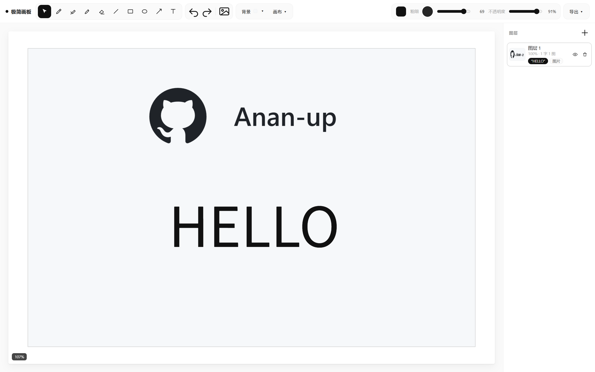

[English](README.md) | [简体中文](README_Simplified_Chinese.md) | [繁體中文](README_Classical_Chinese.md)

A fully-featured **minimalist drawing board** web application built on Canvas, with the core capabilities of professional drawing tools such as layers, object editing, and history.

---

## I. Overview
- A lightweight drawing/design tool that runs in the browser with no installation required.
- Supports **mixed editing of vector text and bitmap images**, with **non-destructive layer management**.
- Suitable for quick sketches, annotations, simple graphic design, and image compositing.

---

## II. Core Feature Modules

### 1. Toolset (10 drawing/editing tools)
| Tool | Function |
|------|----------|
| Select/Move | Select and manipulate existing objects (text, images) |
| Pen, Brush, Pencil | Free drawing; brush has a soft edge (shadow), pencil has a hard edge |
| Eraser | Erase pixels (uses the `destination-out` composite mode, supports opacity) |
| Line, Rectangle, Ellipse | Draw geometric shapes (drag and hold) |
| Arrow | A straight line with an arrowhead at the end |
| Text | Click the canvas to place a text box; supports instant input, color change, and font-size change |

### 2. Layer System
- Supports **multi-layer stacking**, where each layer independently stores its pixels and objects (text/images).
- Layer operations: **create, delete, rename (double-click), show/hide, and drag to reorder**.
- Each layer's thumbnail is shown in the right-side panel, listing its contained text and image objects (clickable to select).

### 3. Object Editing (under the Select tool)
- **Text objects**: can be moved, scaled (via control points), rotated (via the rotation handle), and have their color, font size, and opacity modified.
- **Image objects**: can be moved, scaled, rotated, and have their opacity adjusted.
- Once selected, the **properties panel** automatically syncs to show color, thickness, opacity, and rotation angle, supporting real-time adjustment.
- All object modifications are recorded in **history**.

### 4. Canvas and View Control
- **Zoom**: scroll wheel to zoom, keeping the cursor position fixed.
- **Pan**: Space + left-drag, or middle-button drag.
- **Fit to window**: double-click an empty area of the canvas to reset zoom/pan.
- **Size presets**: built-in canvas sizes (including A3/A4 and phone portrait), or custom width/height (1–8000 px).
- **Background**: solid color (color picker or preset white) or a transparent grid background.

### 5. History (Undo/Redo)
- Records layer structure, all object properties, canvas size, and background color.
- Up to 40 steps; shortcuts **Ctrl+Z / Ctrl+Y** (Cmd on Mac).

### 6. Export Functions
- Supports **PNG (transparent/white/current background)**, **JPEG**, **WebP**, and **copy to clipboard** (PNG).
- Export includes all visible layers and objects.

### 7. Image Insertion
- Via the toolbar button or by dragging an image onto the canvas, it is automatically inserted at the center of the current layer (or at the drop position).
- Supports multi-file selection.

### 8. Right-click Context Menu
- Provides quick actions for copying/deleting objects, adding text, inserting images, undo/redo, layer management, and export.

---

## III. Technical Implementation Highlights

### 1. Double Buffering and Temporary Stroke Compositing
- During free drawing (brush-like strokes), strokes are first drawn on a **temporary canvas (strokeCanvas)** and composited into the layer all at once on pen-up, avoiding opacity multiplication from stacking.
- The eraser operates directly on the layer (`destination-out`), achieving pixel-level erasing.

### 2. Object System and Independent Rendering
- Text and images are stored as **independent objects** within layers (not merged into pixels), supporting transformation and property modification, and are unaffected by layer drawing.
- Object rendering is overlaid on top of layer pixels, preserving vector characteristics.

### 3. Coordinate System and Zoom/Pan
- All interaction coordinates are converted to **document coordinates** (accounting for DPR, zoom, and pan) to ensure precise operation.
- The canvas display area (`vpW/vpH`) is separated from the document size (`W/H`), enabling viewport clipping and scrolling effects (via panning).

### 4. Selection and Transform Handles
- When an object is selected, **8 scale handles** and 1 rotation handle are displayed.
- Scaling intelligently anchors the opposite corner, keeping the rotation angle unchanged (only width/height change).
- Rotation shows the angle value in real time and syncs it to the properties panel slider.

### 5. History Snapshot Mechanism
- Each operation (drawing end, object modification, layer change, etc.) saves a complete snapshot, including the Canvas's base64 data and object parameters.
- On restore, the Canvas and objects are rebuilt, guaranteeing a complete state rollback.

### 6. UI Interaction Details
- Tool buttons have hover tooltips.
- Brush thickness preview: a static preview in the toolbar plus a dynamic ring that follows the cursor (size varies with zoom).
- The top toolbar uses pill-shaped grouping for a clean appearance.
- The layer list in the right-side panel supports drag-to-reorder.

### 7. Keyboard Shortcut Support
- Tool shortcuts: `v` (select), `p` (pen), `b` (brush), `c` (pencil), `e` (eraser), `l` (line), `r` (rectangle), `o` (ellipse), `a` (arrow), `t` (text), `i` (insert image).
- `[` / `]` decrease/increase brush size.
- `Delete` deletes the selected object.
- `Ctrl+0` resets zoom.
- Space for temporary panning.

---

## IV. Code Structure and Maintainability
- Uses **pure JavaScript** (no third-party libraries), ES6+ syntax, clearly organized.
- Centralized state management (the `state` object), with UI and rendering separated.
- Uses inline SVG icons to reduce external requests.
- Debounced window resize handling to optimize performance.

---

## V. Use Cases
- A web-based simple drawing tool, usable for online meeting annotations, design drafts, and teaching demonstrations.
- Can also serve as an image annotation tool, adding text or marks after inserting images.
- Thanks to transparent-background support and multiple export formats, it is suitable for making memes, UI assets, and the like.

---

## Project Screenshots

---
## License

[MIT](LICENSE)
